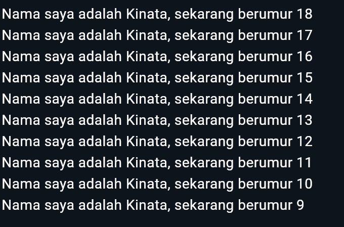

# Laporan Praktikum

NIM : 2241720087 <br>
Nama : Kinata Dewa Ariandi <br>
Kelas : TI 3B

## Module 2

Pengantar Bahasa Pemrograman Dart

### Soal

1. **Kode**:
   ```dart
   void main() {
      for (int i = 18; i >= 9; i--) {
         print('Nama saya adalah Kinata, sekarang berumur $i');
      }
   }
   ```

Hasil :


2. karena Flutter dibangun di atas Dart, sehingga seluruh kode aplikasi Flutter ditulis menggunakan bahasa Dart. Tanpa pemahaman yang baik tentang Dart, pengembang akan kesulitan menulis, membaca, dan memahami kode dalam proyek Flutter.

3.
